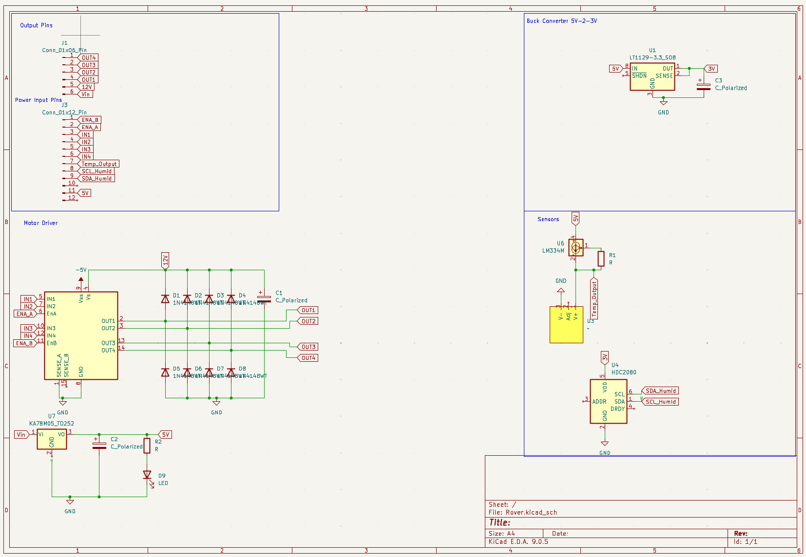
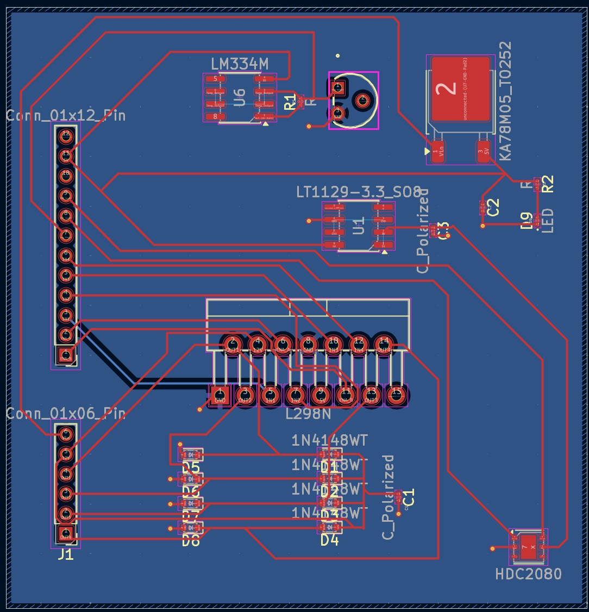
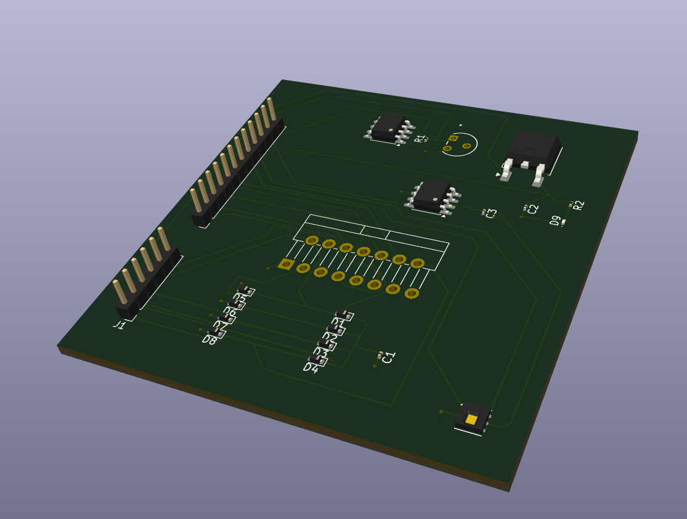

# Rover Control PCB

Custom PCB for driving and monitoring a motor-based rover platform. Handles motor control, regulated power distribution, and onboard environmental sensing.

## Overview

- **Motor driver:** L298N dual H-bridge driving up to 4 outputs (OUT1–OUT4), with flyback diode protection (D1–D8) on each leg.
- **Power distribution:** 12V input regulated down to 5V (KA78M05) and 3.3V (LT1129), with status LED indicator.
- **Sensing:** HDC2080 temperature/humidity sensor (I2C) and an LM334 current-source-based temperature reference circuit.
- **I/O:** 12-pin power/control input connector (J3) and 6-pin motor output connector (J1).

## Schematic

## PCB Layout

## 3D Render

## Bill of Materials (key parts)

| Ref | Part | Function |
|-----|------|----------|
| U5 | L298N | Dual H-bridge motor driver |
| U7 | KA78M05 (TO-252) | 5V linear regulator |
| U1 | LT1129-3.3 (SO-8) | 3.3V linear regulator |
| U6 | LM334M | Current source (temperature reference) |
| U4 | HDC2080 | Temperature/humidity sensor (I2C) |
| D1–D8 | 1N4148WT | Flyback diodes for motor outputs |
| D9 | LED | Power/status indicator |

## Status

Routed on 2 layers with a solid ground pour on the back copper. DRC clean. Pending: final fab check and enclosure/mounting fit.
